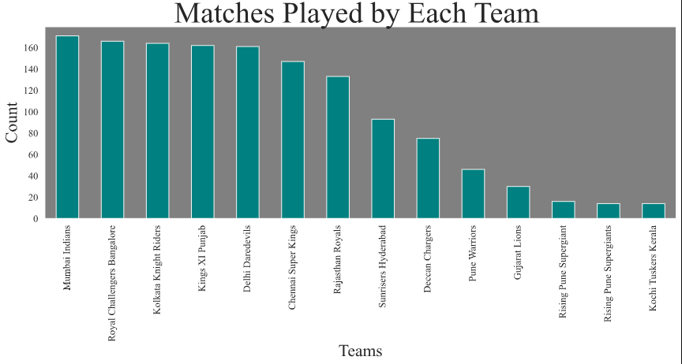
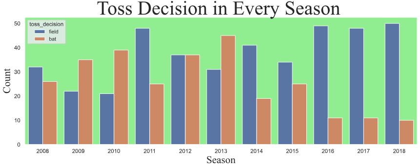
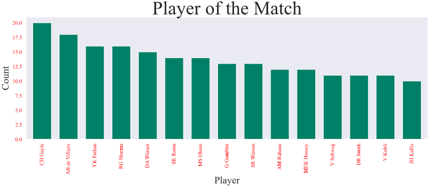
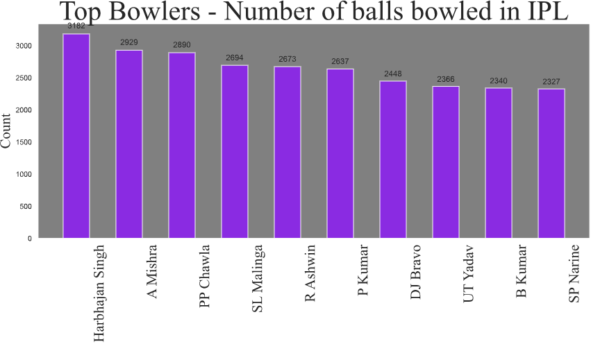
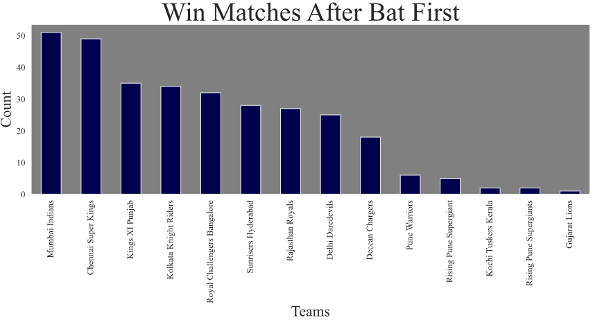
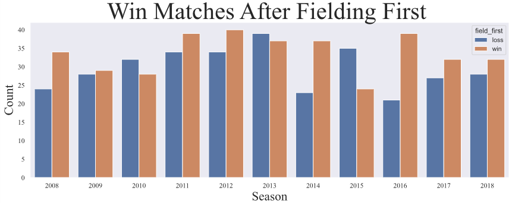
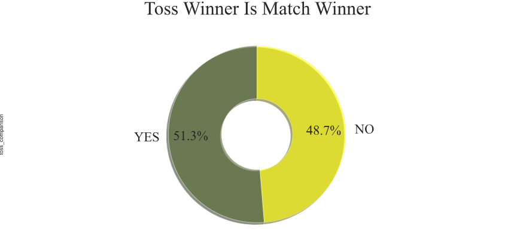
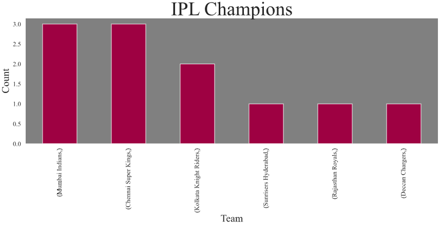

# Exploratory Analysis of IPL 🏏

Gain insights into Indian Premier League (IPL) cricket data with this comprehensive exploratory data analysis (EDA) project. Using Python and popular data science libraries, this project analyzes IPL matches, teams, players, and various statistics to uncover trends and patterns.

---

## Features

- Data cleaning and preprocessing of IPL datasets
- Analysis of matches, teams, and player performances
- Visualizations of runs, wickets, toss decisions, and more
- Insights into winning trends, top performers, and key statistics

---

## Screenshots















<!-- Add your output images in the images/ directory and reference them here -->
<!-- Example: -->
<!--  -->
<!--  -->

---

## Usage

1. Clone the repository:
   ```bash
   git clone https://github.com/arcvrsh/Exploratory-Analysis-of-IPL.git
   cd Exploratory-Analysis-of-IPL
   ```
2. Install dependencies:
   ```bash
   pip install -r requirements.txt
   ```
3. Open the main notebook:
   ```bash
   jupyter notebook IPL_Analysis.ipynb
   ```
   or run in Google Colab:
   [](https://colab.research.google.com/github/arcvrsh/Exploratory-Analysis-of-IPL/blob/main/IPL_Analysis.ipynb)

---

## Contributing

Pull requests are welcome! Please open an issue first to discuss what you would like to change.

---

## License

This project is licensed under the MIT License. See the [LICENSE](LICENSE) file for details.

---

## References

- IPL Dataset: [Kaggle IPL Data](https://www.kaggle.com/datasets/ramjidoolla/ipl-data-set)
- Project inspired by various IPL data analyses and notebooks.

---

*Explore, analyze, and visualize the excitement of IPL cricket!*
